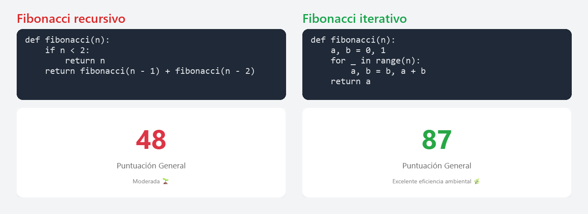
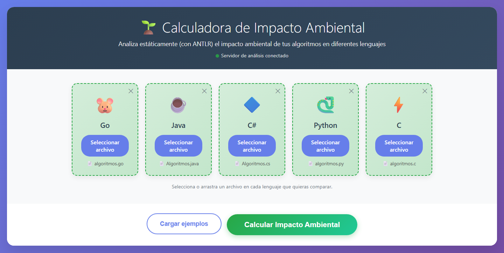
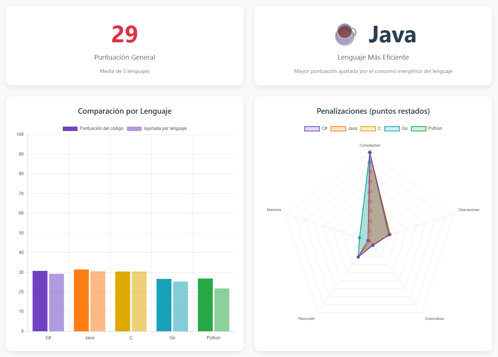
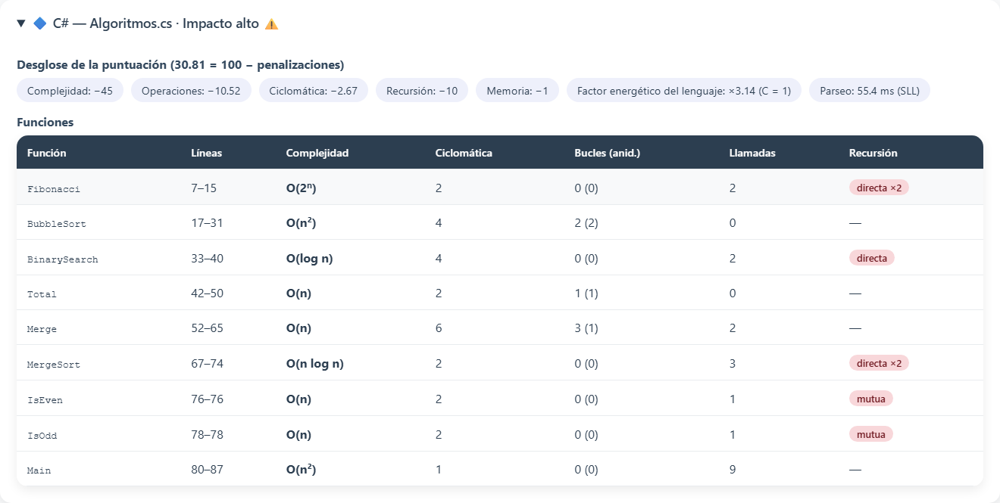
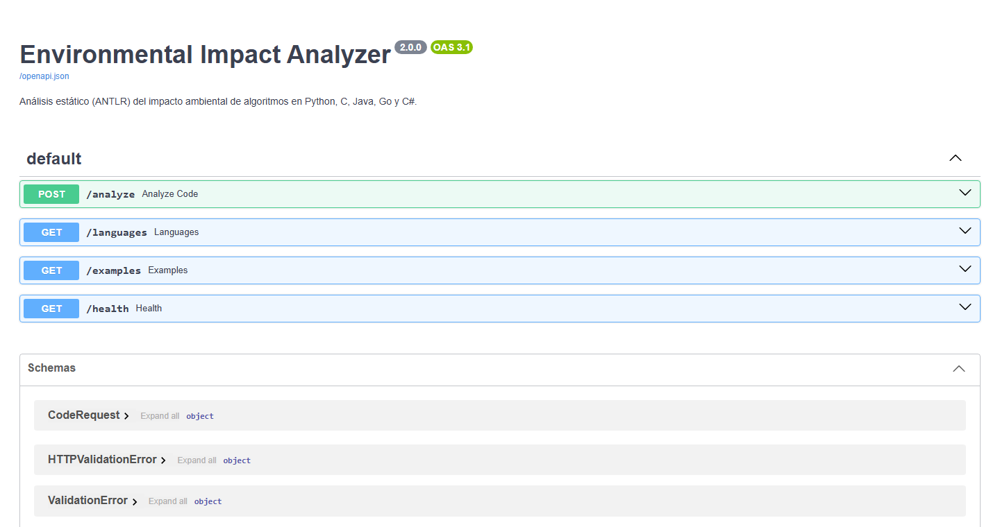

<div align="center">

# 🌱 Calculadora de Impacto Ambiental de Algoritmos

**¿Cuánto contamina tu código?** Sube un archivo en Python, C, Java, Go o C# y obtén su complejidad,<br>sus funciones recursivas y una nota ambiental de 0 a 100, sin ejecutarlo.


<sub><a href="docs/media/demo.mp4">▶ Ver el video en alta calidad (MP4, 51 s)</a></sub>

[El dato curioso](#el-dato-curioso-) · [Capturas](#capturas) · [Inicio rápido](#inicio-rápido) · [Cómo funciona](#cómo-funciona-el-análisis) · [API](#api-rest) · [La puntuación](#la-puntuación-ambiental)

</div>

---

## El dato curioso 🌀

Mismo problema, dos implementaciones. El analizador detecta que el Fibonacci recursivo hace dos llamadas a sí mismo por invocación (**O(2ⁿ)**), mientras que la versión iterativa es un solo bucle (**O(n)**). La nota casi se duplica:

<p align="center">
  
</p>

---

Herramienta web que **analiza estáticamente** código fuente en **Python, C, Java, Go y C#** y estima su impacto ambiental: cuánto trabajo de CPU y memoria implica ejecutarlo y, por tanto, cuánta energía consume.

El análisis es **sintáctico de verdad**: el código no se examina con expresiones regulares. Se tokeniza y se parsea con gramáticas **ANTLR 4** completas de cada lenguaje, y las métricas se calculan recorriendo el **árbol sintáctico** resultante. Así, los comentarios y los strings nunca se confunden con código, se detectan los errores de sintaxis y se entiende la estructura real (qué bucle está dentro de qué otro, qué función llama a cuál, etc.).

> El código **nunca se ejecuta**. Todo el análisis es estático.

---

## Índice

1. [Qué hace](#qué-hace)
2. [Capturas](#capturas)
3. [Inicio rápido](#inicio-rápido)
4. [Uso de la interfaz web](#uso-de-la-interfaz-web)
5. [API REST](#api-rest)
6. [Cómo funciona el análisis](#cómo-funciona-el-análisis)
7. [Métricas que se calculan](#métricas-que-se-calculan)
8. [Estimación de la complejidad](#estimación-de-la-complejidad)
9. [La puntuación ambiental](#la-puntuación-ambiental)
10. [Estructura del proyecto](#estructura-del-proyecto)
11. [Regenerar los parsers de ANTLR](#regenerar-los-parsers-de-antlr)
12. [Tests](#tests)
13. [Añadir un lenguaje nuevo](#añadir-un-lenguaje-nuevo)
14. [Limitaciones](#limitaciones)
15. [Solución de problemas](#solución-de-problemas)

---

## Qué hace

Para cada archivo que subas, la herramienta:

- **Lo parsea** con la gramática oficial de [antlr/grammars-v4](https://github.com/antlr/grammars-v4) y lista los errores de sintaxis que encuentre (línea, columna y mensaje).
- **Encuentra todas las funciones y métodos** y, para cada una, mide bucles, nivel de anidamiento, complejidad ciclomática, llamadas, asignaciones, etc.
- **Construye el grafo de llamadas** del programa para detectar recursión **directa** (`f` llama a `f`) y **mutua** (`par` llama a `impar`, que llama a `par`).
- **Estima la complejidad temporal** (O(1), O(log n), O(n), O(n log n), O(n²), …, O(2ⁿ)) de cada función, teniendo en cuenta también el coste de las funciones a las que llama.
- **Calcula una puntuación ambiental de 0 a 100** y la explica con un desglose de penalizaciones.
- **Ajusta la puntuación según el lenguaje**, usando el consumo energético relativo medido en el estudio *Energy Efficiency across Programming Languages* (Pereira et al., 2017).
- **Compara** varios lenguajes a la vez, con gráficas y tablas.

Resultado con los ejemplos incluidos (los mismos algoritmos escritos en los cinco lenguajes):

| Algoritmo | Complejidad detectada | Recursión |
|---|---|---|
| Fibonacci recursivo | O(2ⁿ) | directa, 2 llamadas por invocación |
| Ordenamiento burbuja | O(n²) | — |
| Búsqueda binaria recursiva | O(log n) | directa, 1 llamada por invocación |
| Suma de una lista | O(n) | — |
| Merge sort | O(n log n) | directa, 2 llamadas por invocación |
| `es_par` / `es_impar` | O(n) | mutua |

Los cinco lenguajes dan **el mismo resultado**, lo que demuestra que el análisis depende de la estructura del algoritmo y no de la sintaxis de cada lenguaje.

---

## Capturas

<table>
  <tr>
    <td width="50%" valign="top">
      
      <p align="center"><b>1. Sube tu código</b> · una casilla por lenguaje, o «Cargar ejemplos»</p>
    </td>
    <td width="50%" valign="top">
      
      <p align="center"><b>2. Compara</b> · nota general, lenguaje ganador y por qué cada uno pierde puntos</p>
    </td>
  </tr>
  <tr>
    <td colspan="2">
      
      <p align="center"><b>3. Mira el detalle</b> · cada función con su complejidad O(…), su ciclomática y si es recursiva (directa o mutua)</p>
    </td>
  </tr>
</table>

---

## Inicio rápido

### Requisitos

- **Python 3.10 o superior** (probado con 3.14).
- **Java 11 o superior**, *solo* si quieres regenerar los parsers (ya vienen generados en `generated/`).

### Instalación y arranque

```bash
cd Enviromental_impact_calculator
pip install -r requirements.txt
uvicorn app:app --reload
```

Abre **http://localhost:8000** en el navegador. Ya está.

> En Windows, si `uvicorn` no se reconoce como comando, usa `python -m uvicorn app:app --reload`.

La documentación interactiva de la API (Swagger) queda en **http://localhost:8000/docs**.

### Entorno virtual (recomendado)

```bash
cd Enviromental_impact_calculator
python -m venv .venv
# Windows:
.venv\Scripts\activate
# Linux / macOS:
source .venv/bin/activate
pip install -r requirements.txt
```

---

## Uso de la interfaz web

1. **Sube un archivo** en la casilla de cada lenguaje que quieras analizar: haz clic en *Seleccionar archivo* o arrástralo encima. Puedes subir de uno a cinco lenguajes. La ✕ quita el archivo.
2. O pulsa **Cargar ejemplos** para rellenar las cinco casillas con los algoritmos de `examples/`.
3. Pulsa **Calcular Amigabilidad Ambiental**.

Verás:

- **Puntuación general**: la media de las puntuaciones de todos los archivos.
- **Lenguaje más eficiente**: el de mayor puntuación *ajustada por lenguaje*.
- **Comparación por lenguaje**: barras con la puntuación del código y la ajustada.
- **Penalizaciones**: radar con los puntos que resta cada factor en cada lenguaje, para ver *por qué* un código puntúa peor.
- **Tabla de métricas** con todos los valores.
- **Detalle por lenguaje** (desplegable): desglose de la nota, errores de sintaxis si los hay y una tabla con cada función (líneas, complejidad, ciclomática, bucles, llamadas y tipo de recursión).

Un indicador bajo el título muestra si el servidor está conectado. También puedes abrir `frontend/index.html` directamente como archivo: en ese caso la página busca la API en `http://localhost:8000`.

---

## API REST

### `POST /analyze`

Analiza un fragmento de código.

```json
{
  "language": "python",
  "code": "def fib(n):\n    return n if n < 2 else fib(n-1) + fib(n-2)\n"
}
```

`language` admite `python` (o `py`, `python3`), `c`, `java`, `go` y `csharp` (o `c#`, `cs`), sin distinguir mayúsculas.

Respuesta (resumida):

```json
{
  "language": "python",
  "language_name": "Python",
  "parsed_with_antlr": true,
  "syntax_ok": true,
  "syntax_errors": [],
  "parse_time_ms": 12.3,
  "prediction_mode": "SLL",
  "metrics": {
    "lines_of_code": 2,
    "functions": 1,
    "loops": 0,
    "max_loop_depth": 0,
    "branches": 1,
    "cyclomatic_avg": 2.0,
    "cyclomatic_max": 2,
    "assignments": 0,
    "operators": 4,
    "calls": 2,
    "allocations": 0,
    "allocations_in_loops": 0,
    "estimated_operations": 6,
    "recursive_functions_count": 1,
    "recursive_functions": ["fib"],
    "estimated_complexity": "O(2ⁿ)"
  },
  "functions": [
    {
      "name": "fib", "line": 1, "end_line": 2,
      "cyclomatic": 2, "loops": 0, "max_loop_depth": 0, "effective_loop_depth": 0,
      "calls": 2, "assignments": 0,
      "recursive": true, "recursion_kind": "directa", "recursion_branching": 2,
      "complexity": "O(2ⁿ)"
    }
  ],
  "eco_score": 48.48,
  "eco_score_breakdown": {
    "complejidad": 45, "operaciones": 1.02, "ciclomatica": 1.5, "recursion": 4.0, "memoria": 0.0
  },
  "interpretation": "Moderada 🌱",
  "language_energy_factor": 75.88,
  "eco_score_language_adjusted": 39.37
}
```

Códigos de error:

| Código | Motivo |
|---|---|
| `400` | Lenguaje no soportado |
| `413` | El código supera 300 000 caracteres |
| `422` | Falta `language` o `code` en el cuerpo |

Un código con errores de sintaxis **no** devuelve error HTTP: se analiza lo que ANTLR pudo recuperar, `syntax_ok` vale `false` y los errores aparecen en `syntax_errors`.

### Otros endpoints

| Método | Ruta | Descripción |
|---|---|---|
| `GET` | `/` | Interfaz web |
| `GET` | `/languages` | Lenguajes soportados, alias, extensiones y factor energético |
| `GET` | `/examples` | Código de los ejemplos de `examples/` |
| `GET` | `/health` | Comprobación de que el servidor responde |
| `GET` | `/docs` | Documentación Swagger |

<p align="center">
  
</p>

### Ejemplo con `curl`

```bash
curl -X POST http://localhost:8000/analyze \
  -H "Content-Type: application/json" \
  -d '{"language": "c", "code": "int f(int n){ int s=0; for(int i=0;i<n;i++) s+=i; return s; }"}'
```

### Uso como librería de Python

```python
from analyzer import analyze

report = analyze(open("mi_codigo.go").read(), "go")
print(report["eco_score"], report["metrics"]["estimated_complexity"])
```

---

## Cómo funciona el análisis

```
código fuente
     │
     ▼
┌──────────────┐   tokens   ┌──────────────┐   árbol    ┌──────────────────┐
│ Lexer ANTLR  │ ─────────▶ │ Parser ANTLR │ ─────────▶ │  TreeAnalyzer    │
│ (+ LexerBase)│            │(+ ParserBase)│  sintáctico│  un recorrido    │
└──────────────┘            └──────────────┘            └────────┬─────────┘
     errores de sintaxis ◀──────────┘                            │ métricas por función
                                                                 ▼
                                                        ┌──────────────────┐
                                                        │ Grafo de llamadas│
                                                        │ Tarjan (SCC)     │──▶ recursión directa/mutua
                                                        │ profundidad      │──▶ complejidad O(...)
                                                        │ interprocedural  │
                                                        └────────┬─────────┘
                                                                 ▼
                                                        puntuación 0-100 + desglose
```

### 1. Parseo (`analyzer/core.py → parse`)

- Se crea el lexer y el parser generados por ANTLR para el lenguaje.
- Se sustituyen los *listeners* de error por defecto (que imprimen en consola) por uno que **recoge los errores** para devolverlos en la respuesta.
- **Parseo en dos fases**, la estrategia recomendada por ANTLR para rendimiento:
  1. Modo de predicción **SLL** con `BailErrorStrategy`: muy rápido; funciona para casi todo el código válido.
  2. Si SLL falla, se repite con **LL completo** y la estrategia de recuperación normal, que es más lenta pero exacta y genera buenos mensajes de error. El modo usado aparece en `prediction_mode`.
- El runtime de ANTLR para Python no es seguro entre hilos, así que cada lenguaje tiene un *lock*.
- Al arrancar el servidor se "calientan" los cinco parsers en segundo plano (la primera vez que se usa uno, ANTLR tarda 1-3 s en deserializar su ATN). Después cada análisis tarda unos 30-60 ms.

### 2. Recorrido del árbol (`TreeAnalyzer.run`)

Un **único recorrido genérico** sirve para los cinco lenguajes. Lo que cambia entre lenguajes está declarado en `analyzer/languages.py` (una `LanguageSpec` por lenguaje):

- qué reglas de la gramática son **definiciones de función** y cómo sacar su nombre (`FuncdefContext` en Python, `MethodDeclarationContext` en Java, `FunctionDefinitionContext` en C…);
- qué nodos son **llamadas a función** (`TrailerContext` que empieza por `(` en Python, `ArgumentsContext` dentro de `MethodCallContext` en Java, `Method_invocationContext` en C#…);
- qué asignaciones no cuentan (valores por defecto de parámetros, argumentos con nombre, anotaciones…);
- qué llamadas reservan memoria (`malloc`, `make`, `append`…).

El resto se reconoce por los **tokens** del árbol, que en los cinco lenguajes coinciden:

- Un nodo es un **bucle** si tiene como hijo directo un token-palabra-clave `for`, `foreach`, `while` o `do`. Así se reconocen igual un `for_stmt` de Python, un `forStmt` de Go, un `iterationStatement` de C o una comprehension `[x for x in …]`.
- Los **puntos de decisión** son `if`, `elif`, `case`, `catch`, `except`, el ternario `?`, `??` y los operadores lógicos `&&`, `||`, `and`, `or`.
- Solo cuentan tokens que **no son identificadores** (una variable llamada `case` no es un `case`).

El recorrido usa una **pila explícita** en lugar de recursión, porque los árboles de ANTLR son muy profundos (cada expresión atraviesa ~15 niveles de reglas de precedencia) y agotarían la pila de Python con archivos grandes.

### 3. Grafo de llamadas (`TreeAnalyzer.analyze_call_graph`)

- El nombre de la función llamada es el identificador justo antes del `(` de la llamada. Así funciona igual `f(x)`, `obj.f(x)`, `self.f(x)`, `pkg.F(x)` o `this.f(x)`.
- Se construye un grafo *función → funciones a las que llama* y se calculan sus **componentes fuertemente conexas** con el algoritmo de **Tarjan**:
  - una función que se llama a sí misma tiene recursión **directa**;
  - un ciclo de varias funciones es recursión **mutua**.
- Con el grafo también se calcula la **profundidad de bucles efectiva** de cada función: si `main` llama a `ordenar()` dentro de un bucle y `ordenar` tiene dos bucles anidados, la profundidad efectiva de `main` es 3.

---

## Métricas que se calculan

| Métrica | Significado |
|---|---|
| `lines_of_code` | Líneas con código real (sin líneas en blanco ni comentarios) |
| `functions` | Funciones y métodos **con cuerpo** (se excluyen los abstractos, de interfaz y los prototipos de C) |
| `loops` | Número de bucles (incluye comprehensions de Python) |
| `max_loop_depth` | Máximo anidamiento de bucles dentro de una misma función |
| `branches` | Condicionales: `if`, `elif`, `case`, `catch`/`except`, ternarios |
| `cyclomatic_avg` / `cyclomatic_max` | Complejidad ciclomática de McCabe por función: `1 + puntos de decisión` |
| `assignments` | Escrituras en memoria: `=`, `+=`, `:=`, `++`, `--`… |
| `operators` | Operaciones aritméticas, lógicas y de comparación |
| `calls` | Llamadas a funciones |
| `allocations` / `allocations_in_loops` | Reservas de memoria (`new`, `malloc`, `make`, `append`, `list()`…) y cuántas están dentro de un bucle |
| `estimated_operations` | Operaciones ejecutadas estimadas: cada operación cuenta `10^profundidad` (se suponen 10 iteraciones por bucle) |
| `recursive_functions` | Funciones con recursión directa o mutua |
| `estimated_complexity` | Peor complejidad temporal estimada de todo el archivo |

Por cada función se devuelven además su línea de inicio y fin, su complejidad, su ciclomática, sus bucles, sus llamadas y el tipo de recursión (`directa`/`mutua`) con el número de auto-llamadas por invocación.

---

## Estimación de la complejidad

Calcular exactamente la complejidad de un programa cualquiera es indecidible, así que se usa una **heurística documentada** que acierta en los patrones algorítmicos habituales. Para cada función se tienen en cuenta:

- **D**: profundidad efectiva de bucles (incluye las funciones llamadas);
- **b**: cuántas auto-llamadas pueden ejecutarse en una misma invocación. Dos llamadas se consideran **excluyentes** si están en ramas distintas de un `if`/`switch`/ternario, o en sentencias `return` distintas. Por eso la búsqueda binaria (`if … return bs(izq); return bs(der)`) tiene b = 1 y Fibonacci (`return fib(n-1) + fib(n-2)`) tiene b = 2;
- **h**: si la función divide el problema (aparece `/ 2`, `// 2`, `>> 1`, `mid`, `middle`, `half`, `medio` o `mitad`).

| Caso | Complejidad | Ejemplo |
|---|---|---|
| Sin recursión | O(nᴰ) | bucles simples y anidados |
| b = 1, divide (h), D = 0 | O(log n) | búsqueda binaria |
| b = 1, sin dividir | O(nᴰ⁺¹) | factorial, recorrer una lista recursivamente |
| b ≥ 2, divide, D = 0 | O(n) | recorrer un árbol binario |
| b ≥ 2, D = 1 | O(n log n) | merge sort, quicksort |
| b ≥ 2, D ≥ 2 | O(nᴰ) | |
| b ≥ 2, sin dividir, D = 0 | O(2ⁿ) | Fibonacci ingenuo, torres de Hanói |
| recursión mutua | como b = 1 | `es_par` / `es_impar` |

---

## La puntuación ambiental

Una puntuación de **0 a 100** (más alta = más eficiente). Se parte de 100 y se restan cinco penalizaciones, cada una con un máximo, que miden factores que aumentan el trabajo de CPU y memoria:

| Penalización | Máximo | Cálculo |
|---|---|---|
| **Complejidad** | 45 | Según la peor complejidad del archivo: O(1) 0 · O(log n) 4 · O(n) 8 · O(n log n) 14 · O(n²) 24 · O(n² log n) 30 · O(n³) 36 · O(n⁴+) 42 · O(2ⁿ) 45 |
| **Operaciones** | 20 | `5 · log10(1 + operaciones_estimadas / 10)` |
| **Ciclomática** | 15 | `1.5 · (ciclomática_media − 1) + 0.5 · max(0, ciclomática_máxima − 10)` |
| **Recursión** | 10 | 4 puntos por función recursiva (coste de pila de cada llamada) |
| **Memoria** | 10 | 0.5 por reserva fuera de bucles + 2 por reserva dentro de un bucle |

La complejidad pesa más porque es lo que más determina el consumo cuando crecen los datos: un algoritmo O(n²) con n = 1 000 000 hace un millón de veces más trabajo que uno O(n).

| Puntuación | Interpretación |
|---|---|
| ≥ 80 | Excelente eficiencia ambiental 🌿 |
| 60 – 79 | Buena eficiencia 🍃 |
| 40 – 59 | Moderada 🌱 |
| < 40 | Impacto alto ⚠️ |

### Ajuste por lenguaje

El mismo algoritmo consume muy distinta energía según el lenguaje. Se usan los valores de consumo normalizado de la tabla 4 de **Pereira et al., *Energy Efficiency across Programming Languages*, SLE 2017** (C = 1):

| Lenguaje | Energía relativa | Multiplicador de la puntuación |
|---|---|---|
| C | 1.00 | × 1.00 |
| Java | 1.98 | × 0.97 |
| C# | 3.14 | × 0.95 |
| Go | 3.23 | × 0.95 |
| Python | 75.88 | × 0.81 |

`puntuación_ajustada = puntuación × (1 − 0.1 · log10(energía_relativa))`

Se usa el logaritmo para que el lenguaje module la nota sin dominarla: un buen algoritmo en Python sigue puntuando mejor que uno malo en C. La puntuación sin ajustar (`eco_score`) evalúa solo el código; la ajustada (`eco_score_language_adjusted`) se usa para elegir el "lenguaje más eficiente".

---

## Estructura del proyecto

```
Enviromental_impact_calculator/          ← raíz del repositorio
├── README.md
├── mockup.html                           prototipo visual original
├── docs/media/                           capturas y video del README
└── Enviromental_impact_calculator/       ← aplicación
    ├── app.py                            API FastAPI + sirve la interfaz web
    ├── requirements.txt
    ├── pytest.ini
    ├── antlr-4.13.2-complete.jar         herramienta ANTLR (solo para regenerar parsers)
    ├── analyzer/                         análisis estático
    │   ├── __init__.py                   analyze(): punto de entrada, arma el informe
    │   ├── core.py                       parseo, recorrido del árbol, grafo de llamadas, complejidad
    │   ├── languages.py                  especificación de cada lenguaje
    │   └── scoring.py                    puntuación ambiental
    ├── grammars/                         gramáticas ANTLR (.g4) de grammars-v4
    │   └── base/                         clases base en Python que necesitan las gramáticas
    ├── generated/                        lexers/parsers generados (no editar a mano)
    ├── tools/
    │   └── generate_parsers.py           regenera generated/ a partir de grammars/
    ├── frontend/
    │   └── index.html                    interfaz web (HTML + JS + Chart.js)
    ├── examples/                         mismos algoritmos en los 5 lenguajes
    └── tests/                            tests con pytest
```

### Las clases base de las gramáticas (`grammars/base/`)

Varias gramáticas de grammars-v4 no son puramente sintácticas: llaman a código auxiliar escrito en el lenguaje destino. Estas clases son la versión en Python de ese código:

| Clase | Para qué sirve |
|---|---|
| `Python3LexerBase` | Genera los tokens `INDENT`/`DEDENT` a partir de la indentación, que es como Python delimita los bloques. Ignora los saltos de línea dentro de `()`, `[]` y `{}` |
| `Python3ParserBase` | Predicados de los patrones de `match` |
| `CSharpLexerBase` | Strings interpolados (`$"Hola {nombre}"`, `$@"…"`, formatos `{x:N2}`): cuenta las llaves para saber cuándo se vuelve al texto del string |
| `CSharpParserBase` | Impide `var a = 1, b = 2;` (no válido en C#) |
| `GoParserBase` | Distingue `paquete.Función` de `Tipo.Método` guardando los paquetes importados; reglas de los `;` implícitos y de los canales `<-chan` |
| `JavaParserBase` | Varargs en `record` y anotaciones con nombre `@A(valor = x)` |

---

## Regenerar los parsers de ANTLR

Los parsers ya están generados en `generated/`. Solo hace falta regenerarlos si modificas una gramática o una clase base:

```bash
cd Enviromental_impact_calculator
python tools/generate_parsers.py
```

Necesita Java 11+. El script:

1. Copia las gramáticas a un directorio temporal cambiando `this.` por `self.`. Las gramáticas de grammars-v4 escriben las acciones con `this.` (válido en Java, C# o JavaScript); en Python hay que usar `self.`. Es lo mismo que hace el script `transformGrammar.py` de grammars-v4.
2. Ejecuta ANTLR 4.13.2 con `-Dlanguage=Python3` y deja el resultado en `generated/`.
3. Copia las clases base de `grammars/base/` a `generated/`.

> ⚠️ La versión del runtime (`antlr4-python3-runtime`) **debe coincidir** con la del `.jar` (4.13.2).

### Cambio en la gramática de Python

En `grammars/Python3Lexer.g4` se ha quitado la alternativa `{this.atStartOfInput()}? SPACES` de la regla `NEWLINE`. Un predicado semántico al principio de una regla impide que ANTLR guarde en caché el DFA del lexer, y con el runtime de Python multiplicaba por ~35 el tiempo de tokenizado (de ~1 s a ~30 ms en el ejemplo incluido). Esa alternativa solo servía para los espacios al principio del archivo, que en Python real ya son un error.

---

## Tests

```bash
cd Enviromental_impact_calculator
python -m pytest
```

69 tests comprueban, entre otras cosas, que:

- los ejemplos de los cinco lenguajes se parsean sin errores;
- cada algoritmo obtiene **la misma complejidad en los cinco lenguajes**;
- se detecta la recursión directa, la mutua y el número de auto-llamadas;
- se cuentan bien los bucles y su anidamiento;
- los comentarios y los strings no se cuentan como código;
- se reportan los errores de sintaxis en los cinco lenguajes;
- funcionan las clases base (strings interpolados de C#, canales de Go, records de Java, indentación de Python);
- la API responde con los códigos HTTP correctos.

---

## Añadir un lenguaje nuevo

1. Copia la gramática de [grammars-v4](https://github.com/antlr/grammars-v4) a `grammars/`. Si usa `superClass`, porta su clase base a Python en `grammars/base/` (en grammars-v4 suele haber una versión en `Python3/`).
2. Añádela a `GRAMMAR_SETS` en `tools/generate_parsers.py` y ejecuta el script.
3. Añade una `LanguageSpec` en `analyzer/languages.py`: lexer, parser, regla inicial, tokens de identificador, reglas de función con su extractor de nombre, detector de llamadas y factor energético.
4. Añade una casilla en `LANGUAGES` de `frontend/index.html`, un ejemplo en `examples/` y sus nombres en `tests/test_analyzer.py`.

---

## Limitaciones

Es un análisis **estático** y **heurístico**. Conviene tenerlo en cuenta al interpretar los resultados:

- **La complejidad es una estimación.** No se conocen los límites reales de los bucles: un `for i in range(10)` cuenta igual que un `for i in range(n)`. Tampoco se sabe qué hacen internamente las funciones de librería (`sorted`, `Arrays.sort`, `qsort`…), que cuentan como una operación.
- **Las llamadas se resuelven por nombre.** Si dos clases tienen un método con el mismo nombre, se tratan como la misma función. Los métodos sobrecargados también se unen.
- **La puntuación mide el algoritmo, no la energía real en julios.** Sirve para comparar implementaciones y detectar código ineficiente, no para medir consumo.
- **C:** las macros del preprocesador no se expanden (las directivas `#` se ignoran). Un código que dependa mucho de macros puede dar errores de sintaxis.
- **Go:** las conversiones de tipo con nombre (`float64(x)`) se cuentan como llamadas, porque sin información de tipos no se pueden distinguir.
- **Python:** se analiza con la gramática de Python 3 de grammars-v4 (hasta `match`/`case`). Construcciones muy recientes pueden no reconocerse.

---

## Solución de problemas

| Problema | Solución |
|---|---|
| `ModuleNotFoundError: No module named 'antlr4'` | `pip install -r requirements.txt` |
| `ModuleNotFoundError: No module named 'generated'` / `'analyzer'` | Ejecuta `uvicorn` y `pytest` **desde la carpeta** `Enviromental_impact_calculator/` (la interior) |
| `uvicorn` no se reconoce como comando | `python -m uvicorn app:app --reload` |
| La web dice "No se puede conectar con el servidor" | Comprueba que `uvicorn` está corriendo y abre la página desde http://localhost:8000 |
| `NameError: name 'this' is not defined` | Los parsers se generaron sin la transformación `this.` → `self.`. Regenéralos con `python tools/generate_parsers.py` |
| `Could not deserialize ATN with version …` | La versión de `antlr4-python3-runtime` no coincide con la del `.jar`. Instala la 4.13.2 |
| La primera petición tarda unos segundos | Es la carga inicial de los parsers; las siguientes tardan ~30-60 ms |

---

## Tecnologías

- [ANTLR 4.13.2](https://www.antlr.org/): generador de parsers.
- Gramáticas de [antlr/grammars-v4](https://github.com/antlr/grammars-v4) (licencias BSD/MIT, ver la cabecera de cada `.g4`).
- [FastAPI](https://fastapi.tiangolo.com/) + [Uvicorn](https://www.uvicorn.org/): API web.
- [Chart.js](https://www.chartjs.org/): gráficas.
- Pereira, R. et al. (2017). *Energy Efficiency across Programming Languages*. SLE 2017. https://doi.org/10.1145/3136014.3136031
